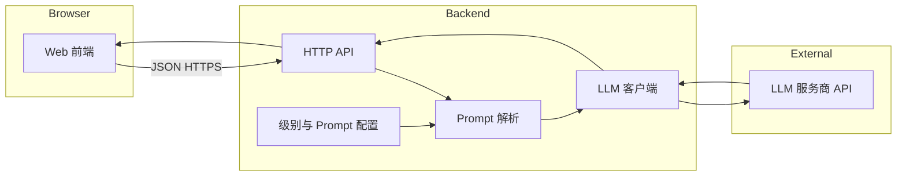

# 系统架构

本文描述分级阅读平台的逻辑架构、为什么需要独立后端、以及推荐模块划分。实现时语言栈（Node / Python）可替换，但**职责边界**与 **API 契约**建议保持一致。

## 为什么需要后端

| 能力 | 说明 |
|------|------|
| 保护密钥 | LLM 的 `API_KEY` 只能放在服务端，前端或浏览器无法安全持有长期密钥。 |
| 单源配置 | 级别与 Prompt 的映射集中存放在服务端（文件或未来数据库），避免前端与后端两套配置分歧。 |
| 治理 | 可在此层做限流、日志、按用户/按 Key 的审计；便于后续接登录与权限。 |
| 统一 LLM 适配 | 更换厂商或模型时只改一处 `llm` 调用层。 |

## 总体结构

## 推荐后端目录（职责对应）

以下路径为逻辑划分，实现时可平铺为 `app/` 或 `src/`。

| 路径/模块 | 职责 |
|-----------|------|
| `config/env` | 从环境变量加载 `LLM_BASE_URL`、`LLM_API_KEY`、`LLM_MODEL`、`PORT` 等。 |
| `config/levels.yaml`（或 `levels.json`） | **level → 元数据 + system 模板 + user 模板**；可含 CEFR 展示名、占位符说明。 |
| `services/promptResolver` | 读取 level 配置，将 `topic`、`wordCount` 等用户输入填入模板，得到 `messages: [{role, content}, ...]`。 |
| `services/llmClient` | 使用 `fetch` 或官方 SDK 调用 **OpenAI 兼容** 的 `POST /v1/chat/completions`（或各厂商兼容路径），返回 assistant 文本。 |
| `routes/health` | 健康检查，供负载均衡或运维探测。 |
| `routes/generate` | 实现 [API.md](./API.md) 中的 `POST /api/generate`；入参校验失败返回 400。 |
| `GET /api/levels`（可选但推荐） | 返回所有可用 level 的 id、名称、CEFR，供前端下拉**与配置文件单源一致**。 |

## 请求处理流程

1. 前端提交 `level` 及可选的 `topic`、`wordCount`。
2. 路由层校验 `level` 在配置中存在。
3. `promptResolver` 生成 `messages`。
4. `llmClient` 请求 LLM，超时与错误在服务端记录并返回统一错误体（不向前端透传内部堆栈与密钥信息）。
5. 将最终英文文本与可选的 `level` 元数据一并返回。

## 前端职责（边界）

- 只负责**选择 level**、输入可选参数、**展示**与**复制**生成结果、错误提示与 loading。
- 不直接调用 LLM；所有生成请求经后端。
- 开发时可通过 Vite `proxy` 将 `/api` 指向本地后端，避免 CORS 配置复杂化。

## 后续扩展（非首期必须）

- 将 `levels` 从文件迁移到数据库，支持管理后台改文案。
- 用户与配额、按组织的 API 限额。
- 对生成内容做**缓存**（同 level + 同主题哈希）以降低成本。
